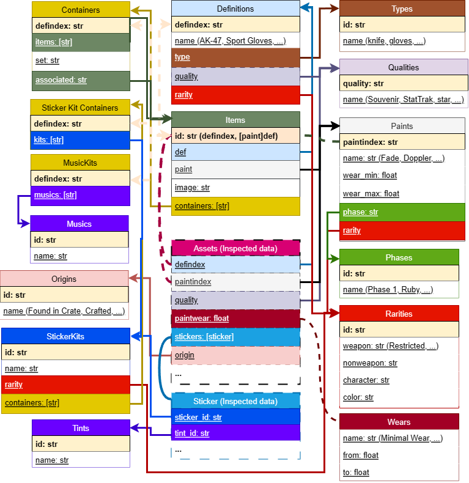
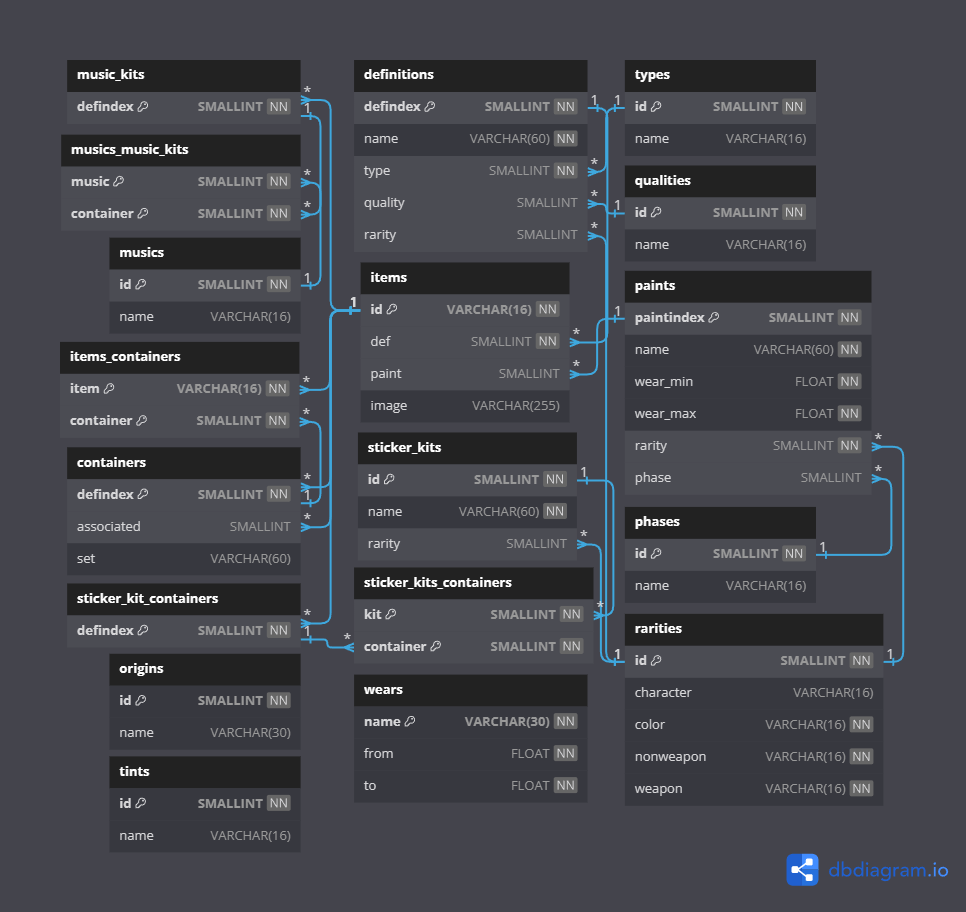

# CS2 Items Schema

English | [中文](README_zh.md)

[](https://github.com/somespecialone/cs2-items-schema/blob/master/LICENSE)
[](https://github.com/somespecialone/cs2-items-schema/actions/workflows/schema.yml)
[](https://github.com/psf/black)
[](https://store.steampowered.com/)

This is storage repo of `CS2` (ex. `CSGO`) items schema with attempt to create more understandable format
of `CS2` items and their relations.

## Improvements 🚀

This project has been enhanced with the following improvements:

- **Chinese name support**: Added Chinese name output for CS2 items, making it more accessible for Chinese users
- **Format fixes**: Optimized data format and structure for better readability and consistency
- **Local file support**: Added automatic download functionality for CS2 game files with multiple data source options

> Feel free to use it if you need 😊

> [!IMPORTANT]
> 📦 Contains data extracted from game files only.
> **Does not include all items**

> [!TIP]
> If you are looking for an `itemnameid` of items for [Steam Market](https://steamcommunity.com/market/),
> check out this repo [somespecialone/steam-item-name-ids](https://github.com/somespecialone/steam-item-name-ids)

> [!NOTE]
> This repo is configured to auto-update itself using the GitHub Actions `Schema` workflow.
> You can take a closer look [there](.github/workflows/schema.yml)

## Integrity schema 🧾

Reflects `json` schemas and relationships between entities



## Diagram 📅

Diagram for SQL database



## Usage 🚀

### Basic Usage (Remote Files)

Run the schema collector using remote data sources (default behavior):

```bash
# Basic remote mode (no raw files saved)
python collect.py

# Remote mode with raw file caching
python collect.py --save-raw
```

### Local File Mode

#### Option 1: Generate Demo Files

Create sample files for testing and development:

```bash
# Generate demo files and use them for schema collection
python collect.py --download-demo --local
```

#### Option 2: Use Existing Local Files

If you already have CS2 game files in a local directory:

```bash
# Use existing files in ./static directory (default)
python collect.py --local

# Use files from a custom directory
python collect.py --local --local-dir /path/to/your/files
```

#### Option 3: Steam Login Download (Advanced)

Download files directly from Steam CDN using your Steam account:

```bash
# Steam login (will prompt for password securely)
python collect.py --steam-login your_username --local

# With 2FA code
python collect.py --steam-login your_username --steam-2fa 12345 --local
```

### Command Line Options

| Option | Description |
|--------|-------------|
| `--local` | Use local files instead of remote URLs |
| `--local-dir PATH` | Directory containing local game files (default: `static`) |
| `--download-demo` | Generate demo files for testing |
| `--steam-login USERNAME` | Download using Steam login (prompts for password securely) |
| `--steam-2fa CODE` | Steam 2FA code (for use with `--steam-login`) |
| `--save-raw` | Save raw game files to static/ directory when using remote mode |

### Requirements for Steam Login

To use Steam login functionality, install the additional dependency:

```bash
pip install steam
```

### File Structure

The local files should be organized as follows:

```
static/
├── items_game.txt      # Main items definition file
├── csgo_english.txt    # English localization
├── csgo_schinese.txt   # Chinese localization
├── items_game_cdn.txt  # CDN information
└── manifestId.txt      # Version tracking
```

## TODO

- [x] Sticker capsules
- [x] Souvenir packages
- [x] Item sets
- [x] ~~Graffiti with tints~~
- [x] SQL scripts and schema
- [x] Local file support and automatic download

## Credits

* [csfloat/cs-files](https://github.com/csfloat/cs-files)
* [draw.io](https://draw.io)
* [dbdiagram.io](https://dbdiagram.io/)
